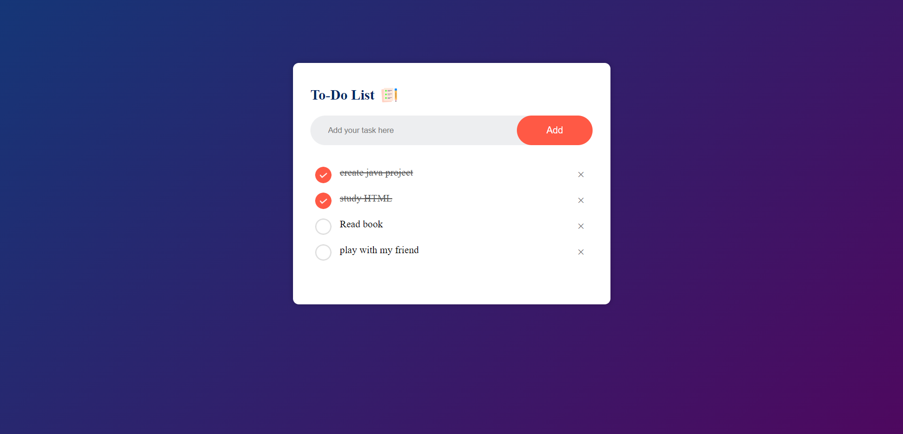

# Todo-List Project


This project is written in HTML, CSS and Javascript that help me to finish the tasks.

## Result:



------

## Code:
### Functions
#### 1- To add task `addTask()`
##### First check if the input is empty or not, if empty,the window out alert, if not empty, the window will add a task
 ```javascript
 function addTask(){
    if(inputBox.value === ""){
        alert("Please Enter a Task");
    }
    else{
        let li = document.createElement("li");
        li.innerText = inputBox.value;
        listContainer.appendChild(li);
        let span = document.createElement("span");
        span.innerText = "\u00D7";
        li.appendChild(span);
    }
    inputBox.value = "";
    saveData();

}
```
------
#### 2- To save data in local storage `saveData()`
##### This function is used to save user data to the page's local storage
```javascript
 function saveData(){
     localStorage.setItem("data", listContainer.innerHTML);
 }
```
------
#### 3- To show data from local storage `showData()`
##### This function is used to show user data from the page's local storage
```javascript
 function showData(){
    listContainer.innerHTML = localStorage.getItem("data");
}
```
------

## Live Demo:

you can view live demo from [here](https://mahmoud128.github.io/Todo-list/)

------
## Accounts:
### Linkedin [Account](https://www.linkedin.com/in/mahmoud-khaleel-78932a1b5/)
### LeetCode [Account](https://leetcode.com/mahmoud_khaleel/)
